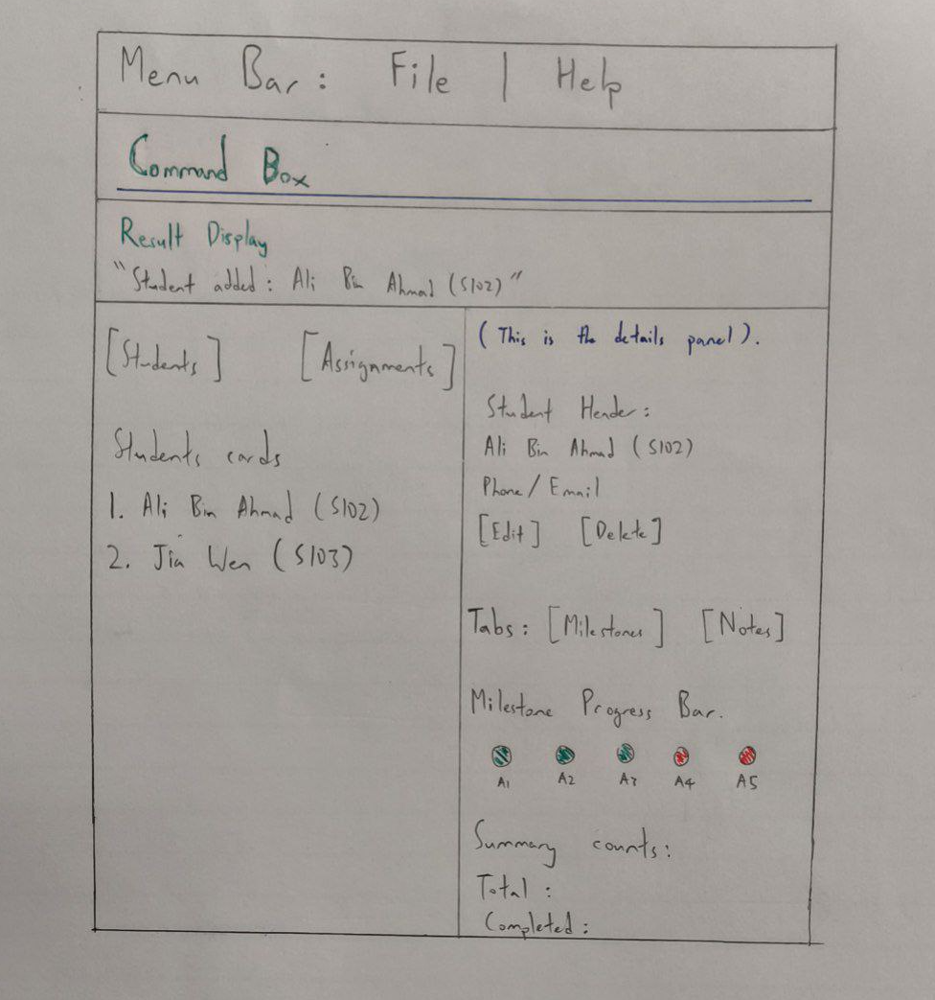

## Overview
**LeTutor** is a desktop application that helps Software Engineering course tutors manage and review GitHub pull requests more efficiently than using the GitHub web interface.

It allows tutors to quickly find PRs from their assigned students, track review progress, and keep review work organised. For course managers (e.g., professors, head TAs), it provides visibility into review activity so they can monitor whether PRs are being handled in a timely and consistent manner.

PRT communicates with GitHub using the GitHub API and is intended for use in an educational setting where many student PRs must be reviewed regularly.
