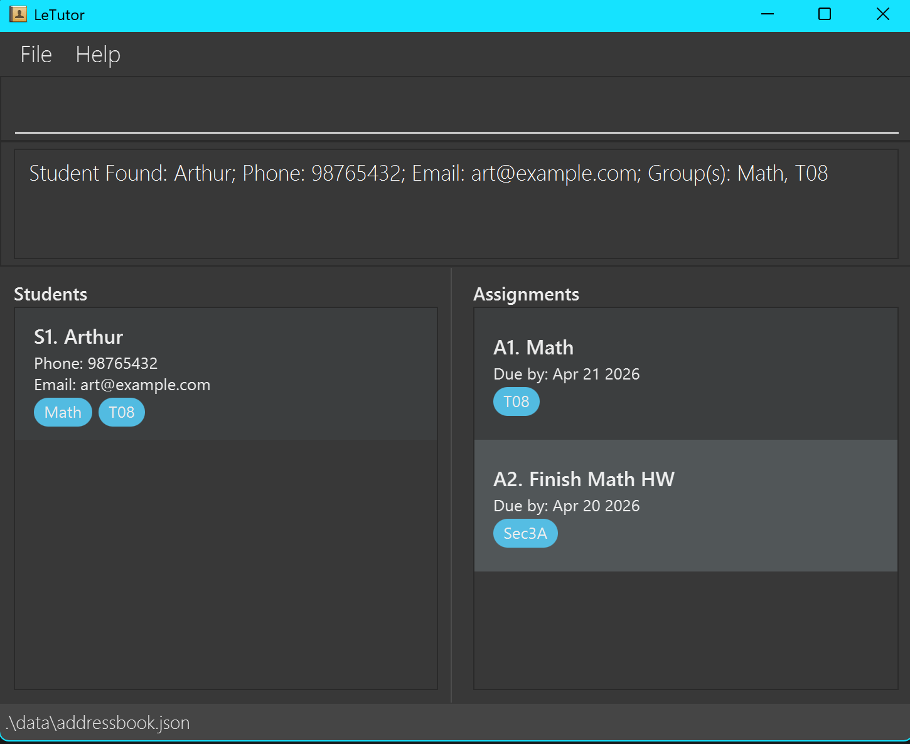
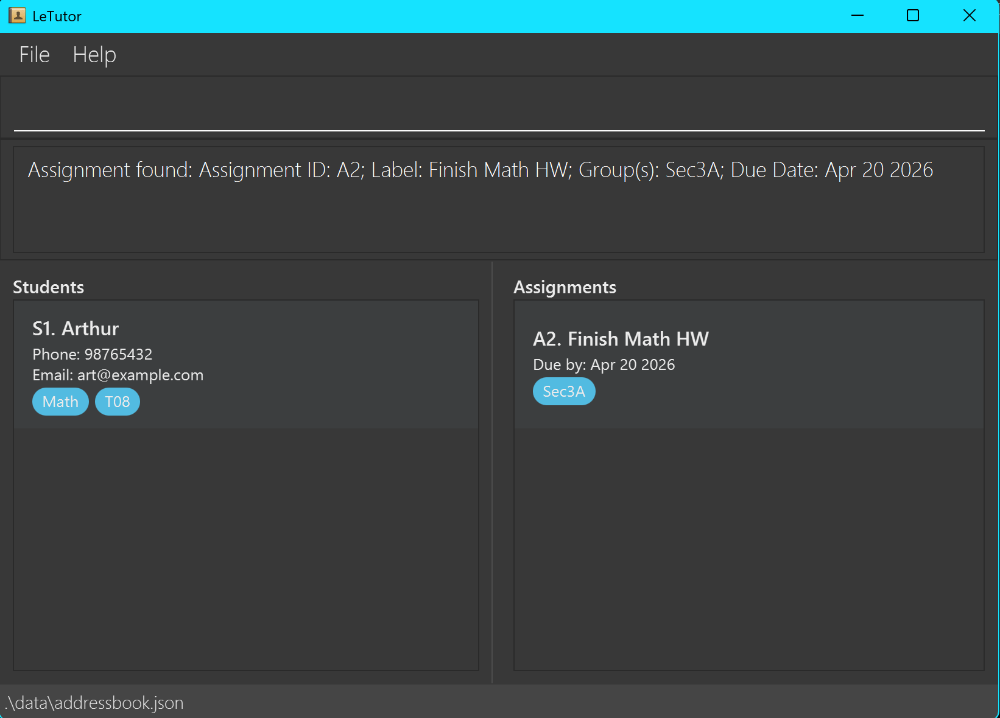
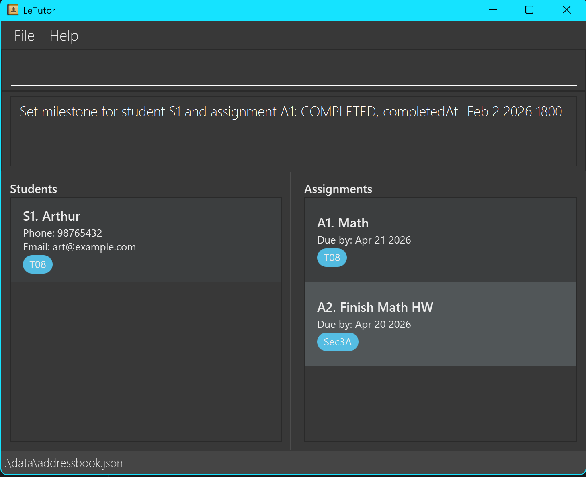

# LeTutor User Guide

---

## Who is this guide for?

LeTutor is built for **tutors and educators** who need a fast way to manage **students**, **assignments**, and **milestone progress** without relying on spreadsheets or clicking through many menus.

This guide is written for users who:
- are comfortable using a computer and typing commands
- want a clear step-by-step explanation of each feature
- do not need programming knowledge to use the app

## What problem does LeTutor solve?

Keeping track of multiple students, class groups, assignment deadlines, and completion progress can get messy very quickly. LeTutor gives you one place to:

- **Manage students efficiently** — store student contact details and group memberships
- **Manage assignments cleanly** — create assignments and assign them to one or more groups
- **Track progress clearly** — view and update milestone completion per student
- **Filter relevant information quickly** — find students by name or show only students and assignments belonging to a chosen group

---

## Table of Contents

1. [Quick Start](#quick-start)
2. [Key Concepts](#key-concepts)
3. [Features](#features)
   - [Notes about the command format](#notes-about-the-command-format)
   - [Viewing help — `help`](#viewing-help--help)
   - [Adding a student — `add /students`](#adding-a-student-add-students)
   - [Editing a student — `edit /students`](#editing-a-student-edit-students)
   - [Deleting a student — `delete /students`](#deleting-a-student-delete-students)
   - [Adding an assignment — `add /assignments`](#adding-an-assignment-add-assignments)
   - [Editing an assignment — `edit /assignments`](#editing-an-assignment-edit-assignments)
   - [Deleting an assignment — `delete /assignments`](#deleting-an-assignment-delete-assignments)
   - [Listing all students and assignments — `list`](#listing-all-students-and-assignments-list)
   - [Listing all students only — `get /students`](#listing-all-students-only-get-students)
   - [Listing all assignments only — `get /assignments`](#listing-all-assignments-only-get-assignments)
   - [Viewing a specific student — `get /students STUDENT_ID`](#viewing-a-specific-student-get-students-student-id)
   - [Viewing a specific assignment — `get /assignments ASSIGNMENT_ID`](#viewing-a-specific-assignment-get-assignments-assignment-id)
   - [Viewing student milestones — `get /students ... /milestones`](#viewing-student-milestones-get-students-milestones)
   - [Updating a milestone — `set /students ... /milestones`](#updating-a-milestone-set-students-milestones)
   - [Finding students by name — `find /students`](#finding-students-by-name-find-students)
   - [Finding students and assignments by group — `find /groups`](#finding-students-and-assignments-by-group-find-groups)
   - [Clearing all entries — `clear`](#clearing-all-entries-clear)
   - [Exiting — `exit`](#exiting-the-program-exit)
4. [Things to Note](#things-to-note)
   - [Saving the data](#saving-the-data)
   - [Editing the data file](#editing-the-data-file)
5. [FAQ](#faq)
6. [Known Issues](#known-issues)
7. [Command Summary](#command-summary)

---

## Quick start

### Installation

1. Ensure you have **Java 17 or above** installed on your computer.
   - **Windows:** Follow the [Java 17 Installation Guide for Windows](https://se-education.org/guides/tutorials/javaInstallationWindows.html)
   - **Mac:** Follow the [Java 17 Installation Guide for Mac](https://se-education.org/guides/tutorials/javaInstallationMac.html) exactly
   - **Linux:** Follow the [Java 17 Installation Guide for Linux](https://se-education.org/guides/tutorials/javaInstallationLinux.html)

2. Download the latest `letutor.jar` from the [GitHub Releases page](https://github.com/AY2526S2-CS2103T-T08-4/tp/releases).

3. Create a folder anywhere on your computer and place `letutor.jar` inside it. This folder will also store your LeTutor data.

4. Open a terminal:
   - **Windows:** Search for **PowerShell** or **Command Prompt**
   - **Mac:** Open **Terminal**
   - **Linux:** Open your preferred terminal

5. Navigate to the folder containing `letutor.jar`. For example:
```
cd C:\Users\YourName\LeTutor
```

6. Run the app:
```
java -jar letutor.jar
```

7. The app window should appear within a few seconds.

8. Type a command into the command box and press <kbd>Enter</kbd> to run it.

---

## Key Concepts

Here are the core concepts that LeTutor uses:

### Student

A student entry stores:

1. Student ID
2. Name
3. Phone number
4. Email address
5. One or more groups

Student IDs are automatically generated and appear in the format `S1`, `S2`, `S3`, ...

### Assignment

An assignment stores:

1. Assignment ID
2. Label
3. One or more groups
4. Due date

Assignment IDs are automatically generated and appear in the format `A1`, `A2`, `A3`, ...

### Group

A group connects students and assignments.
If a student and an assignment share **at least one group**, that assignment can appear in the student's milestone view.

### Milestone status

Milestones show a student's progress for relevant assignments.

Stored statuses:

* `NOT_STARTED`
* `COMPLETED`

View-only computed status:

* `OVERDUE`

> **Note:** `OVERDUE` is not manually set. It appears automatically when the due date has passed and the milestone is still incomplete.
{: .note}
---

## Features

### Notes about the command format

> **Note:**
> Words in `UPPER_CASE` are values you must supply.
> Example: in `get /students STUDENT_ID`, `STUDENT_ID` should be replaced with something like `S1`.
{: .note}

> **Note:**
> Values inside `< >` are placeholders shown for explanation only. Do not type the `<` and `>` symbols literally.
{: .note}

> **Note:**
> Fields inside `{ ... }` must be entered in the stated order.
{: .note}

> **Note:**
> Fields inside `[ ... ]` are only required for certain values of the other parameters. Read the rules for the specific command.
{: .note}

> **Note:**
> Multiple groups inside one field should be separated by commas.
> Example: `Sec3A, Sec3B`
{: .note}

> **Note:**
> Commands such as `help`, `list`, `clear`, and `exit` ignore extra text after them.
{: .note}

> **Caution:**
> If you are copying commands from a PDF or document, check that spaces were copied correctly before pasting into LeTutor.
{: .caution}
---

### Viewing help : `help`

Shows a message explaining how to access the help page.

Format: `help`
{: .format}

**Expected output:** A help window appears.


---

### Adding a student : `add /students`

Adds a student to LeTutor.

Format: `add /students {NAME; PHONE; EMAIL; GROUPS}`
{: .format}

**Parameter reference:**

| Field    | Description                             |
|----------|-----------------------------------------|
| `NAME`   | Student's full name                     |
| `PHONE`  | Student's phone number                  |
| `EMAIL`  | Student's email address                 |
| `GROUPS` | One or more groups, separated by commas |

Rules:

* The phone number must be within 3-15 digits.
* The email should contain `@`.
* The name, phone, email, and group fields must not contain `;`.
* The groups field supports multiple groups separated by commas.

Examples:

* `add /students {John Doe; 98765432; johnd@example.com; Sec3A}`
* `add /students {Jane Tan; 91234567; janetan@email.com; Sec3A, Math}`

> **Tip:**
> Use consistent group names and capitalization across students and assignments. For example, avoid mixing `Sec3A`, `sec3a`, and `SEC3A` as these will be interpreted as **different groups**.
{: .tip}

> **Note:**
> Each student must have a unique phone number **and** a unique email address. Students are allowed to have the same name as long as both their phone and email are unique.
{: .note}

**Expected output:** The student appears in the list and a confirmation message is shown.


---

### Editing a student : `edit /students`

Edits the details of an existing student.

Format: `edit /students STUDENT_ID {NAME; PHONE; EMAIL; GROUPS}`
{: .format}

Rules:

* The `STUDENT_ID` identifies which student to edit.
* You may leave fields empty if you do not want to change them.
* Semicolons `;` must still be typed to indicate the fields.
* The `GROUPS` field follow the same rules and formatting as the one in `add /students`.

Examples:

* `edit /students S2 {John Doe; 98765432; johnd@mail.com; Sec3B}`
* `edit /students S2 {John; ; ;}`
* `edit /students S2 {; 91234567; ;}`

> **Tip:**
> Use empty fields carefully. Keep the semicolons in place so LeTutor can tell which field you are skipping.
{: .tip}

**Expected output:** The student's details are updated and a confirmation message is shown.


---

### Deleting a student : `delete /students`

Deletes a student from LeTutor.

Format: `delete /students STUDENT_ID`
{: .format}

Example:

* `delete /students S3`

> **Note:** Entering a `STUDENT_ID` that does not exist will reset the student list to show all available students
{: .note}

> **Caution:**
> Deletion is permanent and cannot be undone within the app.
{: .caution}

**Expected output:** The student is removed and a confirmation message is shown.


---

### Adding an assignment: `add /assignments`

Adds an assignment to LeTutor.

Format: `add /assignments {LABEL; GROUPS; DUE_DATE}`
{: .format}

**Parameter reference:**

| Field      | Description                             |
|------------| --------------------------------------- |
| `LABEL`    | Assignment name or label                |
| `GROUPS`   | One or more groups, separated by commas |
| `DUE_DATE` | Due date in `YYYY-MM-DD` format         |

Rules:
* Assignments can belong to more than one group.
* The label and group fields must not contain `;`.
* The `GROUPS` field follows the same rules and formatting as the one in `add /students`.
* The `DUE_DATE` field must follow the specified format strictly.

Examples:

* `add /assignments {Finish Math HW; Sec3A; 2026-04-20}`
* `add /assignments {Science Quiz; Sec3A, Sec3B; 2026-04-01}`

> **Tip:**
> Use consistent group names across students and assignments as GROUPS are case-sensitive.
{: .tip}

**Expected output:** The assignment appears in the assignment list and a confirmation message is shown.


---

### Editing an assignment : `edit /assignments`

Edits the details of an existing assignment.

Format: `edit /assignments ASSIGNMENT_ID {LABEL; GROUPS; DUE_DATE}`
{: .format}

Rules:

* The `ASSIGNMENT_ID` identifies which assignment to edit.
* You may leave fields empty if you do not want to change them.
* Semicolons `;` must still be typed to indicate the fields.
* The groups field supports multiple groups separated by commas.

Examples:

* `edit /assignments A1 {A-Testing; Sec3A; 2026-05-30}`
* `edit /assignments A2 {Math Worksheet; Sec3A, Sec3B; 2026-05-01}`
* `edit /assignments A3 {Quiz 2; ; }`

**Expected output:** The assignment is updated and a confirmation message is shown.


---

### Deleting an assignment : `delete /assignments`

Deletes an assignment from LeTutor.

Format: `delete /assignments ASSIGNMENT_ID`
{: .format}

Example:

* `delete /assignments A2`

> **Note:** Entering an `ASSIGNMENT_ID` that does not exist will reset the assignment list to show all available assignments
{: .note}

> **Caution:**
> Deleting an assignment removes it from the system permanently.
{: .caution}

**Expected output:** The assignment is removed and a confirmation message is shown.


---

### Listing all students and assignments : `list`

Shows all students and assignments currently in LeTutor.

Format: `list`
{: .format}

> **Tip:**
> Run `list` after using a find filter if you want to return to the full student and full assignment list.
{: .tip}

**Expected output:** The student list resets to show all students. The assignment list resets to show all assignments.

---

### Listing all students only : `get /students`

Shows all students currently in LeTutor.

Format: `get /students`
{: .format}

> **Note:** There should not be any input after the `get /students` command.
{: .note}

**Expected output:** The student list resets to show all students. The assignment list retains its current view.

---

### Listing all assignments only : `get /assignments`

Shows all assignments currently in LeTutor.

Format: `get /assignments`
{: .format}

> **Note:** There should not be any input after the `get /assignments` command.
{: .note}

**Expected output:** The assignment list resets to show all assignments. The student list retains its current view.

---

### Viewing a specific student : `get /students STUDENT_ID`

Shows the selected student in the app.

Format: `get /students STUDENT_ID`
{: .format}

* `STUDENT_ID` is automatically generated.
* Student IDs are shown in the format `S1`, `S2`, `S3`, ...

Example:

* `get /students S1`

**Expected output:** The selected student is shown in the student list.



---

### Viewing a specific assignment : `get /assignments ASSIGNMENT_ID`

Shows the selected assignment in the app.

Format: `get /assignments ASSIGNMENT_ID`
{: .format}

Rules:

* `ASSIGNMENT_ID` are automatically generated.
* Assignment IDs are shown in the format `A1`, `A2`, `A3`, ...

Example:

* `get /assignments A2`

**Expected output:** The selected assignment is shown in the assignment list.



---

### Viewing student milestones : `get /students ... /milestones`

Shows the milestone progress of a student.

Format: `get /students STUDENT_ID /milestones`
{: .format}

Rules:

* Each milestone corresponds to one assignment.
* A student sees milestones only for assignments that share **at least one group** with the student.
* The milestone list is shown in assignment ID order.
* Stored milestone statuses are `NOT_STARTED` and `COMPLETED`.
* `OVERDUE` is computed automatically for display.

Example:

* `get /students S1 /milestones`

Example milestone output:

* `A1 | NOT_STARTED | due=2026-04-01 | completedAt=-`
* `A2 | COMPLETED | due=2026-04-03 | completedAt=2026-03-30T1200H`
* `A3 | OVERDUE | due=2026-03-20 | completedAt=-`

> **Tip:**
> This command is useful when preparing for a lesson and you want to check a student's outstanding work quickly.
{: .tip}

**Expected output:** The student's milestone progress is shown.


---

### Updating a milestone : `set /students ... /milestones`

Sets the milestone status of one assignment for one student.

Format: `set /students STUDENT_ID /milestones ASSIGNMENT_ID STATUS [COMPLETED_AT]`
{: .format}

**Parameter reference:**

| Field           | Description                                                                            |
|-----------------|----------------------------------------------------------------------------------------|
| `STUDENT_ID`    | ID given to the student shown in the Student list                                      |
| `ASSIGNMENT_ID` | ID given to the assignment shown in the Assignment list                                |
| `STATUS`        | Completion status of the assignment. Consists of `NOT_STARTED`, `COMPLETED`, `OVERDUE` |
| `COMPLETED_AT`   | Date field that is required depending on the value of `STATUS`                         |


Rules:
* `STUDENT_ID` values look like `S1`, `S2`, `S3`, ...
* `ASSIGNMENT_ID` values look like `A1`, `A2`, `A3`, ...
* Only the following stored statuses are allowed:
   * `NOT_STARTED`
   * `COMPLETED`
* If the status is `NOT_STARTED`, do **not** provide `COMPLETED_AT`.
* If the status is `COMPLETED`, you **must** provide `COMPLETED_AT`.
* The `COMPLETED_AT` field takes in a value with the format `<YYYY-MM-DD> <HHMM>` (with **no arrows**). Replace the `YYYY-MM-DD` and `HHMM` parameters with the actual date and time values respectively with a space between.
* A space **must** be included between the 2 parameters (date and time) mentioned. 
* Do not include square brackets `[]` for the `COMPLETED_AT` field.
* `OVERDUE` cannot be set manually.
* The student and assignment must share **at least one group**.

> **Caution:** If you try to manually overwrite `OVERDUE` status to `NOT_STARTED`, the system will ignore the request and there will not be any messages indicating so. However, you are able to update an assignment's status to `COMPLETED` even if it was `OVERDUE`.
{: .caution}

> **Caution:** If the assignment was already `OVERDUE` and you updated its status to `COMPLETED`, any following attempts to update the status to `NOT_STARTED` will cause the status to revert back to `OVERDUE`.
{: .caution}

Examples:

* `set /students S1 /milestones A1 NOT_STARTED`
* `set /students S1 /milestones A1 COMPLETED 2026-03-30 1200`

> **Note:**
> Use `NOT_STARTED` if you want to reset a milestone to incomplete.
{: .note}

**Expected output:** The milestone status is updated and a confirmation message is shown.



---

### Finding students by name : `find /students`

Finds students whose names contain any of the given keywords.

Format: `find /students <keywords>`
{: .format}

Rules:

* Search is case-insensitive.
* Keyword order does not matter.
* Only full words are matched.
* Students matching at least one keyword will be returned.

Examples:

* `find /students Johnny`
* `find /students alex david`

> **Tip:**
> Use this command before editing or deleting a student if you need to narrow down the list first.
{: .tip}


**Expected output:** Only matching students remain visible in the student list.


---

### Finding students and assignments by group : `find /groups`

Finds all students and assignments that belong to the specified group.

Format: `find /groups GROUP_NAME`
{: .format}

Rules:

* The student list is filtered to show only students in the specified group.
* The assignment list is filtered to show only assignments tagged to that group.
* The group name should match an existing group name exactly (case-sensitive).
* If no matching group is found, no students and no assignments will be shown.

Example:

* `find /groups T08`

**Expected output:** The result display shows a summary such as:

* `X persons listed and Y assignments listed for Group "T08"`


---

### Clearing all entries : `clear`

Clears all student and assignment entries from LeTutor.

Format: `clear`

> **Caution:**
> This permanently deletes all student and assignment data in the app. There is no confirmation step or warning.
{: .caution}

**Expected output:** The lists become empty and a message is shown indicating the data has been cleared.

---

### Exiting the program : `exit`

Closes LeTutor.

Format: `exit`

**Expected output:** The application closes. All changes have already been saved automatically.

---

## Things to note

### Saving the data

LeTutor saves data automatically to the hard disk after every command that changes data. There is no need to save manually.

### Editing the data file

LeTutor data is saved automatically as a JSON file at:

`[JAR file location]/data/addressbook.json`

Advanced users may update the data file directly.

> **Caution:**
> If the file is edited into an invalid format, LeTutor may discard the data and start with an empty file on the next run or crash and become unusable.
{: .caution}

> **Caution:**
> Only edit the data file if you are confident that you understand the structure.
{: .caution}

---

## FAQ

**Q: How do I move my data to another computer?**

A: Install LeTutor on the other computer and replace its generated data file with the `addressbook.json` file from your original LeTutor folder.

**Q: Why does `get /students S1 /milestones` not show every assignment in the system?**

A: A student only sees assignments that share at least one group with that student.

**Q: Can I manually set a milestone to `OVERDUE`?**

A: No. `OVERDUE` is computed automatically by the app based on due date and completion status.

**Q: Can one assignment belong to more than one group?**

A: Yes. Separate group names with commas when adding or editing an assignment.

---

## Known Issues

1. **When using multiple screens**, if you move the application to a secondary screen and later return to using only one screen, the GUI may open off-screen. Delete the `preferences.json` file and relaunch the app.

2. **If the Help Window is minimized**, running `help` again will not open a new help window. Restore the minimized help window manually.

3. **The application allows you to set an assignment as `COMPLETED` with a `COMPLETED_AT` date in the future.** This is technically not possible in real life (to be completing something in future), so please do not set your `COMPLETED_AT` date to be in the future.
---

## Command Summary

| Action                     | Format                                                                    | Example                                                        |
|----------------------------|---------------------------------------------------------------------------|----------------------------------------------------------------|
| **Help**                   | `help`                                                                    | `help`                                                         |
| **Add student**            | `add /students {NAME; PHONE; EMAIL; GROUPS}`                        | `add /students {John Doe; 98765432; johnd@example.com; Sec3A}` |
| **Edit student**           | `edit /students STUDENT_ID {NAME; PHONE; EMAIL; GROUPS}`           | `edit /students S1 {John Doe; 98765432; johnd@mail.com; Sec3B}` |
| **Delete student**         | `delete /students STUDENT_ID`                                             | `delete /students S3`                                          |
| **Add assignment**         | `add /assignments {LABEL; GROUPS; DUE_DATE}`                           | `add /assignments {Math; Sec3A, Sec3B; 2026-03-20}`            |
| **Edit assignment**        | `edit /assignments ASSIGNMENT_ID {LABEL; GROUPS; DUE_DATE}`             | `edit /assignments A1 {Quiz 2; Sec3A, Sec3B; 2026-04-01}`      |
| **Delete assignment**      | `delete /assignments ASSIGNMENT_ID`                                       | `delete /assignments A2`                                       |
| **List all**               | `list`                                                                    | `list`                                                         |
| **List students**          | `get /students`                                                           | `get /students`                                                |
| **List assignments**       | `get /assignments`                                                        | `get /assignments`                                             |
| **Get student**            | `get /students STUDENT_ID`                                                | `get /students S3`                                             |
| **Get assignment**         | `get /assignments ASSIGNMENT_ID`                                          | `get /assignments A2`                                          |
| **Get student milestones** | `get /students STUDENT_ID /milestones`                                    | `get /students S1 /milestones`                                 |
| **Set milestone**          | `set /students STUDENT_ID /milestones ASSIGNMENT_ID STATUS [COMPLETED_AT]` | `set /students S1 /milestones A1 COMPLETED 2026-03-30 1200`    |
| **Find students**          | `find /students <keywords>`                                               | `find /students alex david`                                    |
| **Find groups**            | `find /groups GROUP_NAME`                                                 | `find /groups Science`                                         |
| **Clear**                  | `clear`                                                                   | `clear`                                                        |
| **Exit**                   | `exit`                                                                    | `exit`                                                         |
